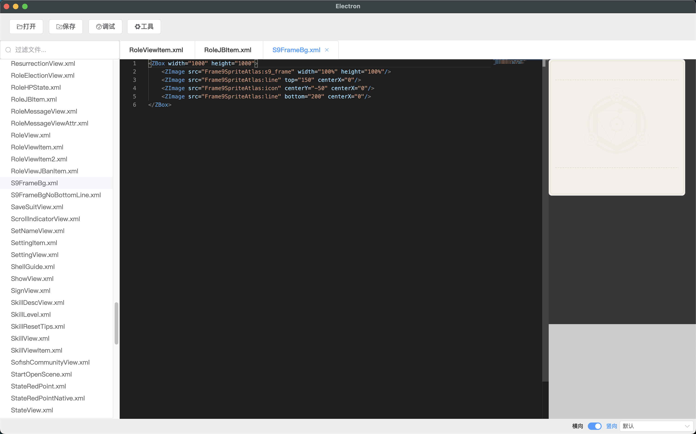

# ZIde
Zygameui的UI可视化编辑器v2.0

# v2.0说明
工具从2.0开始，使用`hxvue3`重构了整个编辑器功能；

## 运行效果


## 编译
- Mac:
```shell
# 将自动编译成electron目标，并运行
make build
```


## 支持功能
- 支持zygameui的所有渲染特性（同步最新版本11.0.7）。
- 可视化XML立即渲染。
- Ctrl+B（Command+B）可进行快速编译界面。

## WINDOW
- Window版本需要手动为app运行`npm install`来确保库的完整性。
- 需要在app目录下放置zip/unzip.exe命令行工具，以便允许Zide进行更新操作。
- 需要在app/node_moudle下重新安装完整的`sharp`环境，以便允许Zide进行PSD导出操作。